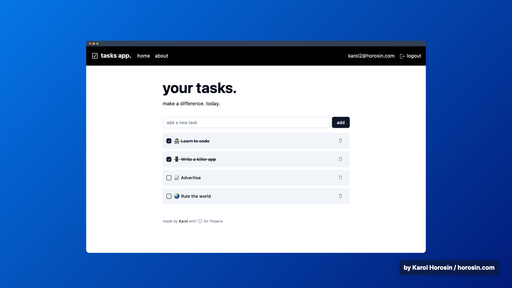

# Tasks application

A simple tasks application that allows you to add, remove and mark tasks as done.

Developed as an excercise.

Demo available here: https://tasks.slidesgenerator.com/

<p align="center">
    
</p>

## Run locally

To run the application locally in production mode and use it make sure you have docker installed.

Then, just execute the following command:

```bash
docker compose -f docker-compose.prod.yml up --build
```

The application will be available at `http://localhost`.

It's a good idea to first create an account and then log in!

## Develop locally

To run the application in development mode, you need to run the frontend and the backend separately.

It is recommended that you use provided docker compose file to start the postgres database.

To start the database, run:
```bash
docker compose up -d
```

Then copy the env file and adjust as fit:
```bash
cp server/.env.example server/.env
```

Then, in separate terminals, run the frontend and the backend.

Frontend:
```bash
cd frontend
npm install
npm run dev
```

Backend:
```bash
cd server
npm install
npm run start:dev
```

The app will be available at `http://localhost:5173`.

## Deployment

For the purpose of this excercise I have deployed the application to a server hosted in the cloud.

I have used a domain I had available and connected to Cloudflare for the purpose of setting up SSL encryption.

The application is available at: https://tasks.slidesgenerator.com/

The app is deployed using a github action that copies the files to the server and restarts the docker container.

I wanted to demonstrate this as a part of the excercise, since this is a part of the development process.

Real-world deployment pipeline would include also:
- running tests
- building containers
- pushing containers to a container registry
- deploying containers to a server or a cloud provider

So this is a very simplified version of a deployment pipeline.

Nginx is used to host the static version of the frontend as well as a reverse proxy for the whole app.

## Technology stack

- React
- Vite
- TypeScript
- Nest.js
- TypeORM
- PostgreSQL
- Docker

## Development notes

### UI library

The app uses shadcn/ui library for the UI components.

I have chosen this library because of it's popularity and "you own the code" approach.

### Routing

Routing is done using react-router.

I have adopted a pages structure similar to the one used in Next.js. This is a good practice to keep the code organized and helps with onboarding new developers.

All of the pages are in the `app` directory. Each page has it's own directory with the page component and any other components that are used only on that page. One may create subdirectories for nested routes. Path-specific components and helpers may be stored in a subdirectory starting with "_".

E.g.
   - `/` route lives in `app/page.tsx` file.
   - `auth/login` route lives in `app/auth/login/page.tsx` file.

New pages need to also be registered in the `app/routes.ts` file.

Layouts for pages are stored at the level of a route and apply donwwards.

E.g. `app/auth/layout.tsx` is a layout for all pages under `/auth` route.

This is just a convention.

## Author

Built by Karol Horosin

- [LinkedIn](https://www.linkedin.com/in/horosin/)
- [GitHub](https://github.com/horosin)
- [Blog](https://horosin.com/)